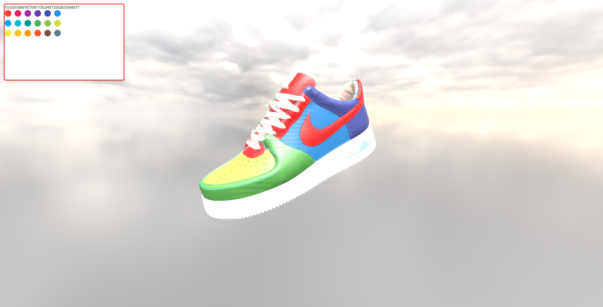

# 👟 Shoe Customizer

An interactive 3D shoe customization web app that lets users personalize their shoes in real time.  
Built using **React** and **Three.js**, this app focuses on smooth user experience and aesthetic presentation.

## 🎨 Features

- Real-time 3D shoe preview
- Change materials, colors, and textures on different parts of the shoe

## 🚀 Tech Stack

- **React** – Component-based frontend
- **Three.js** – 3D rendering
- **Tailwind CSS** – Styling
- **React-Three-Fiber** – React renderer for Three.js
- **Vite** – Lightning-fast build tooling

## 📸 Preview

<!-- Replace with your actual screenshot or demo GIF -->


## 🔧 Getting Started

### Prerequisites

- Node.js >= 18
- A modern web browser

### Installation

```bash
git clone https://github.com/your-username/shoe-customizer.git
cd shoe-customizer
npm install
npm run dev
